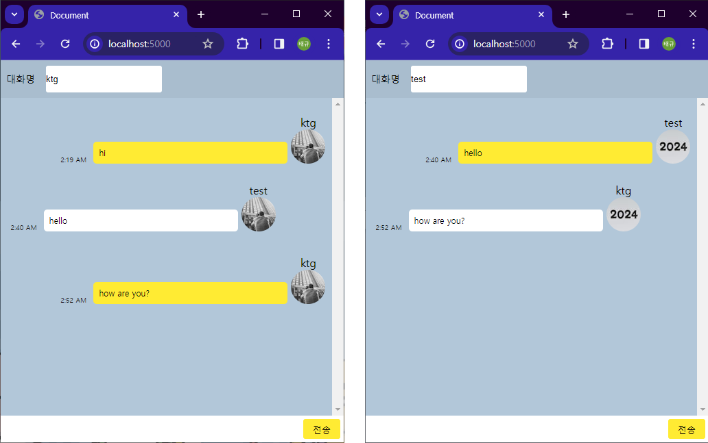

## 🤷 프로젝트를 하게 된이유

최근 트위터의 서비스 종료가 이슈가 되며, 실시간 스트리밍에 대한 경쟁사의 열기가 오르고 있다는 점에서 WebRTC 기술을 공부해보고, 사용해보면 좋을 것이라는 생각이 들었다.

마침 다니고있는 교육 프로그램인 SSAFY에서 WebRTC를 주제로 선택 과제를 내주었으니, 간단하게 구현해보고, 관련 공부를 해보도록 한다.

## 🚩 개발 기간, 인원

2023년 12월 28일 ~ 29일 (2일)

FE, BE 총 1명

## 🤼‍ 내 기여도

FE 100%, BE100%

## 📕 사용된 기술

| 이름      | 설명                                                       |
| --------- | ---------------------------------------------------------- |
| express   | 채팅 서버를 만드는데 사용한 Node.js 라이브러리             |
| socket.io | 소켓 서버를 연결하기 위해 백, 프론트에서 사용한 라이브러리 |

## 🌐 구현 페이지

## 💭 느낀점

### 1. 어려웠던 점

기존에 알던 HTTP 의 TCP/UDP 통신 방식을 공부할 때 네트워크에 실제 통신 코드를 분석하는 포스팅을 보고 이해하는데 큰 도움이 되었었는데, 이번에는 이와 유사한 포스팅을 찾기 어려워 글만 보고 이해하는데 조금 어려움이 있었다.

그러나 그림과 사용 예시들을 보면서 직접 타이핑해보고 어떤 방식으로 데이터가 오가는지 이해할 수 있었다.

### 2. 배운 것

WebRTC, WebSocket에 대한 기본적인 개념을 알게 되었고, 통신에 사용할 수 있는 라이브러리들에 대해 공부해 볼 기회가 되었다.

## 📚 레퍼런스

1. WebRTC 란? 
   https://velog.io/@heejinkim0812/WebRTC%EB%9E%80

1. WebSocket 이란? 
   https://appmaster.io/ko/blog/websocketiran-mueosimyeo-eoddeohge-saengseonghabniggas

1. SockJS와 Socket.io의 차이 
   https://stackshare.io/stackups/socket-io-vs-sockjs

1. Websocket과 Socket.io의 차이 
   https://www.peterkimzz.com/websocket-vs-socket-io

1. Stompjs와 Socket.io의 차이 
   https://velog.io/@syi9595/Socket.js-%EC%99%80-Stomp%EB%9E%80

1. 구현 참고 영상 
   https://www.youtube.com/watch?v=UoKoPP91Qx0&pp=ygUWc29ja2V0aW8g7LGE7YyFIOq1rO2YhA%3D%3D
